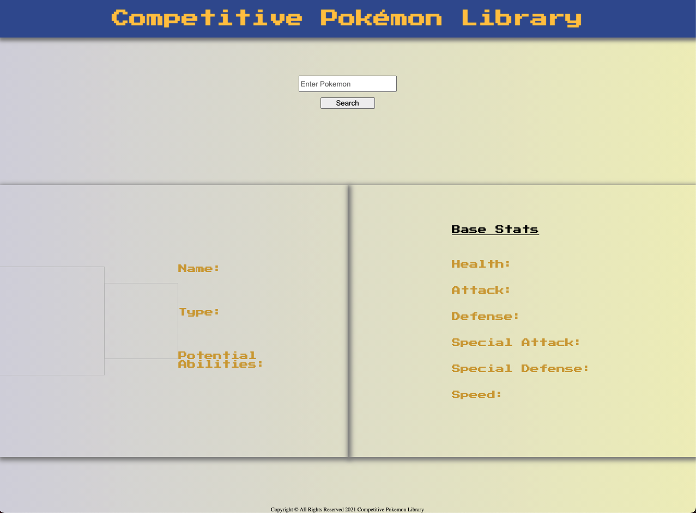
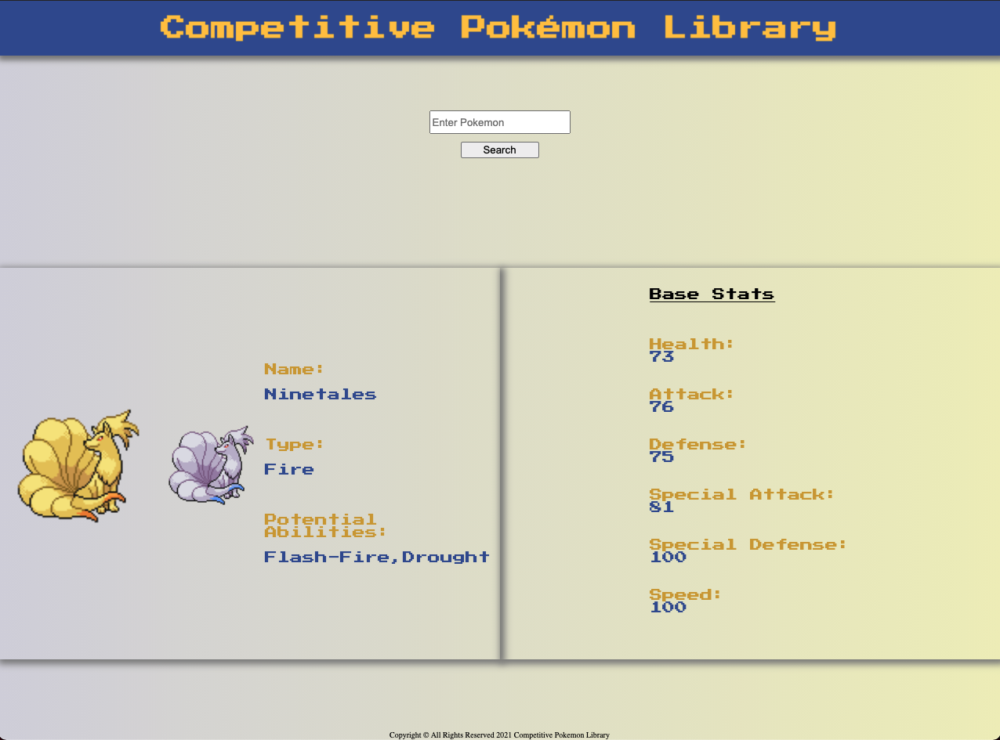

## 📚 Competitive Pokemon Library

An app that allows you to search for Pokemon, and disaply any relevant information for that Pokemon regarding competitive battling.

## 💻 Technologies Used
- HTML
- CSS 3
- JS
- jQuery
- [Pokemon API](https://pokeapi.co/)
- Github Pages (for deployment)

## 📸 Screenshots

Before searching for a Pokemon

After searching

## 🛠 Future Improvements
- Live track usage stats to update how common certain pokemon are as well as common movesets/ items.
- Update information with the release of future Pokemon games.